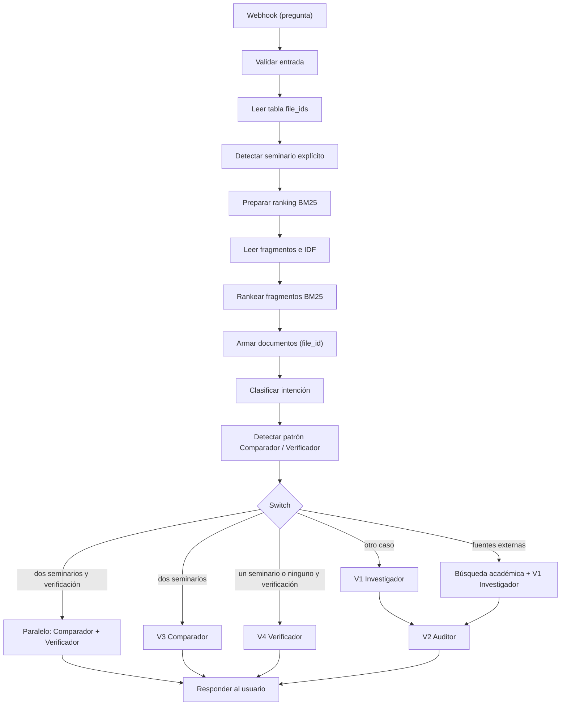

# Arquitectura y parámetros de LACAN·LAB

## Visión general

Workflow **«LACAN-LAB_V7_con_BM25»** en n8n Cloud, de 40 nodos, con tres Data Tables y cuatro agentes diferenciados. La interfaz es un único archivo HTML (`app/lacanlab_consulta_v4_legal.html`) que envía la consulta por POST a un webhook y espera `{ respuesta_v1, citas_v1[], auditoria_v2 }`.

## Flujo

## Corpus

- 30 PDF de seminarios; 9 sin capa de texto (OCR por lotes de 8, más el Seminario 20).
- Páginas dobles divididas; fragmentos de aproximadamente 10 páginas; 29 textos normalizados.
- Los PDF **no** se incluyen en este repositorio (derechos de autor).

## Índice (Data Tables)

`lacan_file_ids`, `lacan_bm25_idf` y `lacan_fragment_index`. Campos: longitud, frecuencia de términos, páginas desde/hasta, tokens estimados, versión.

## BM25

| Parámetro | Valor |
| --- | --- |
| Variante de IDF | idf_positive |
| k1 | 1,5 |
| b | 0,75 |
| N_DOCS | 587 |
| AVGDL | ≈ 5205,19 |
| TOP_K | 5 (versión final del workflow) |

Cálculo de la página original: página inicial del fragmento + página citada − 1. Si no hay evidencia, el sistema devuelve un error controlado.

## Ramas del Switch

| Condición | Agente(s) |
| --- | --- |
| Dos seminarios + afirmación verificable | Comparador + Verificador (en paralelo) |
| Dos seminarios sin verificación | Comparador |
| Un seminario o ninguno + verificación | Verificador |
| Solicitud explícita de fuentes externas | Búsqueda académica restringida + Investigador |
| Cualquier otro caso (*fallback* documental) | Investigador seguido de Auditor |

## Modelos y límites de salida

| Agente | Modelo | max_tokens |
| --- | --- | --- |
| V1 Investigador | Claude Sonnet | 6000 |
| V2 Auditor | Claude Haiku | 3000 |
| V3 Comparador | Claude Haiku | 1024 |
| V4 Verificador | Claude Haiku | 1024 |
| Inferir seminario | Claude Haiku | 300 |

## Búsqueda académica restringida

Google Programmable Search sobre una lista cerrada de 29 dominios (instituciones lacanianas y repositorios argentinos, franceses, españoles, brasileños y anglosajones). Recupera hasta cinco resultados, que se entregan a V1 como contexto y nunca como evidencia.

## Qué hace el sistema y qué no

El contrato es explícito: devuelve la pregunta, la respuesta del Investigador, las citas asociadas y la auditoría del Auditor. Produce respuesta, citas y auditoría; no emite decisiones. El Auditor es otro modelo de lenguaje y no reemplaza el contraste humano con la edición de referencia.
